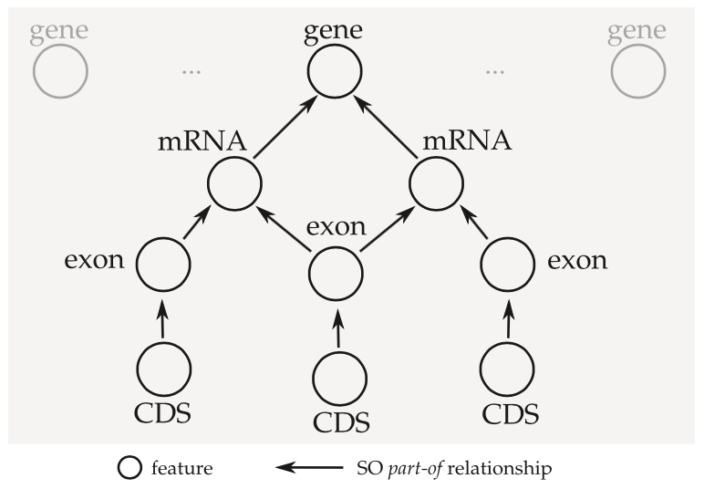

A crash course in annotation formats
====================================

Data file formatting is the perennial topic of jokes and rants in the bioinformatics community.
For many scientists, it's easier to come up with a new *ad hoc* format than it is to take the time to fully understand and adhere to existing formats (due in large part to the poor state of training for data and computing literacy and poor support for standards development in the life sciences).
There's even a running joke that inventing your own file format is an important rite of passage in becoming a "true" bioinformatician.

.. raw:: html

   <blockquote class="twitter-tweet" data-lang="en">
Introducing the Bioinformatics Ironman: write an assembler, a short/long read aligner and a file format
&mdash; Pall Melsted (@pmelsted) <a href="https://twitter.com/pmelsted/status/680697640212951040">December 26, 2015</a></blockquote>
   

For annotating genome features, there are several formats in wide use, the most common of which include `GFF3 <https://github.com/The-Sequence-Ontology/Specifications/blob/master/gff3.md>`_, `GTF <http://mblab.wustl.edu/GTF22.html>`_, and `BED <https://genome.ucsc.edu/FAQ/FAQformat.html#format1>`_.
These are all plain-text tab-delimited file formats.

    | *Although there are many richer ways of representing genomic features via XML and in relational database schemas, the stubborn persistence of a variety of ad-hoc tab-delimited flat file formats declares the bioinformatics community's need for a simple format that can be modified with a text editor and processed with shell tools like grep.*
    |     -- Lincoln Stein, `GFF3 specification <https://github.com/The-Sequence-Ontology/Specifications/blob/master/gff3.md>`_

GFF3 vs GTF vs BED
------------------

There are a lot of similarities between the "big three" annotation formats, but there are also some important differences (`this has been covered before <https://standage.github.io/on-genomic-interval-notation.html>`_).
BED and GTF were designed for very specific use cases (visualization and gene prediction, respectively), whereas GFF3 was designed as a generalized solution for genome annotation.
BED allows for a single level of feature decomposition (a feature can be broken up into blocks) and GTF supports two levels (exons can be grouped by **transcript_id**, and transcripts grouped by **gene_id**), while GFF3 supports an arbitrary number of levels (parent/child relationships defined by **ID** and **Parent** attributes specify a directed acyclic graph of features).
And finally, GFF3 and GTF use 1-based closed interval notation, whereas BED uses 0-based half-open interval notation which makes interval arithmetic much simpler.

One common complaint about GFF3 is that all the "action" happens in the 9th column, which consists of free-form key/value pairs for storing metadata and relationships between annotated features.
To a large extent this complaint applies to all of these formats.

Why GFF3?
---------

GFF3 is the preferred annotation encoding for the **tag** package.
Despite its use of 1-based closed interval notation (inferior to the notation used by BED), GFF3 is the most robust and flexible format for describing genomic features.

There may be some level of support for GTF and BED in the future, but it will likely be limited to scripts for converting data into GFF3.
This is a difficult problem to solve generically, since each annotation format exists in so many subtly incompatible variants.
Rather, this will likely be handled on a case-by-case basis: for example, conversion scripts for a small number of tools or databases that produce data in a consistent GTF or BED format.

Annotation graphs
-----------------

The concept of an "annotation graph" was first introduced by Eilbeck *et al.* (`citation <https://dx.doi.org/10.1186%2Fgb-2005-6-5-r44>`_) and then elaborated on by Gremme *et al.* (`citation <http://dx.doi.org/10.1109/TCBB.2013.68>`_).
The **tag** library relies on this concept heavily.
In short, rather than processing a data file one entry at a time (line by line), the idea is to group related features into a directed acyclic graph structure.

This has some implications for the terminology we use to describe annotations.

* When we say *feature* we could be referring to a single node in the annotation graph, or we could be referring to an entire connected component.
* We use *parent* and *child* to refer to **part_of** relationships between features and related subfeatures.
  In GFF3 these are encoded using **ID** and **Parent** attributes.
  Feature types and **part_of** relationships can be validated using the `Sequence Ontology <http://www.sequenceontology.org/>`_.
* A feature is a *top-level feature* if it has no parents.

The **tag** package provides two primary means for processing the annotation graph.

* iterating over the top-level features in the entire graph
* for a particular feature (connected component) in the graph, iterating over all connected subfeatures

Multiple parents
----------------

A node in a feature graph can have more than one parent, and the GFF3 specification explicitly permits features to have multiple **Parent** attribute values.
For example, in an alternatively spliced gene, different isoforms will often share exons, and the canonical way to reflect this is for each shared exon to refer to each of its parent mRNAs in its **Parent** attribute.
However, in my experience it is much more common for shared exons to be duplicated in the GFF3 file, once for each isoform to which they belong.
This isn't wrong *per se* from a standards perspective, but it can be misleading when (for example) counting up different feature types or calculating sequence characteristics.

Currently the **tag** library does little to warn the user of duplicate entries.
It is up to the user to inspect the data to determine how it is encoded and how statistics on the features should be calculated and interpreted.

Multi-features
--------------

Some genome features exist discontinuously on the sequence, and therefore cannot be declared with a single GFF3 entry (which can encode only a single interval).
The canonical encoding for these types of features is called a multi-feature, in which a single feature is declared on multiple lines with multiple entries all sharing the same feature type and ID attribute.
This is commonly done with coding sequence (**CDS**) features.

**tag** designates one entry for each multi-features as its *representative*, and all other components of that feature are designated *siblings* of the representative.
